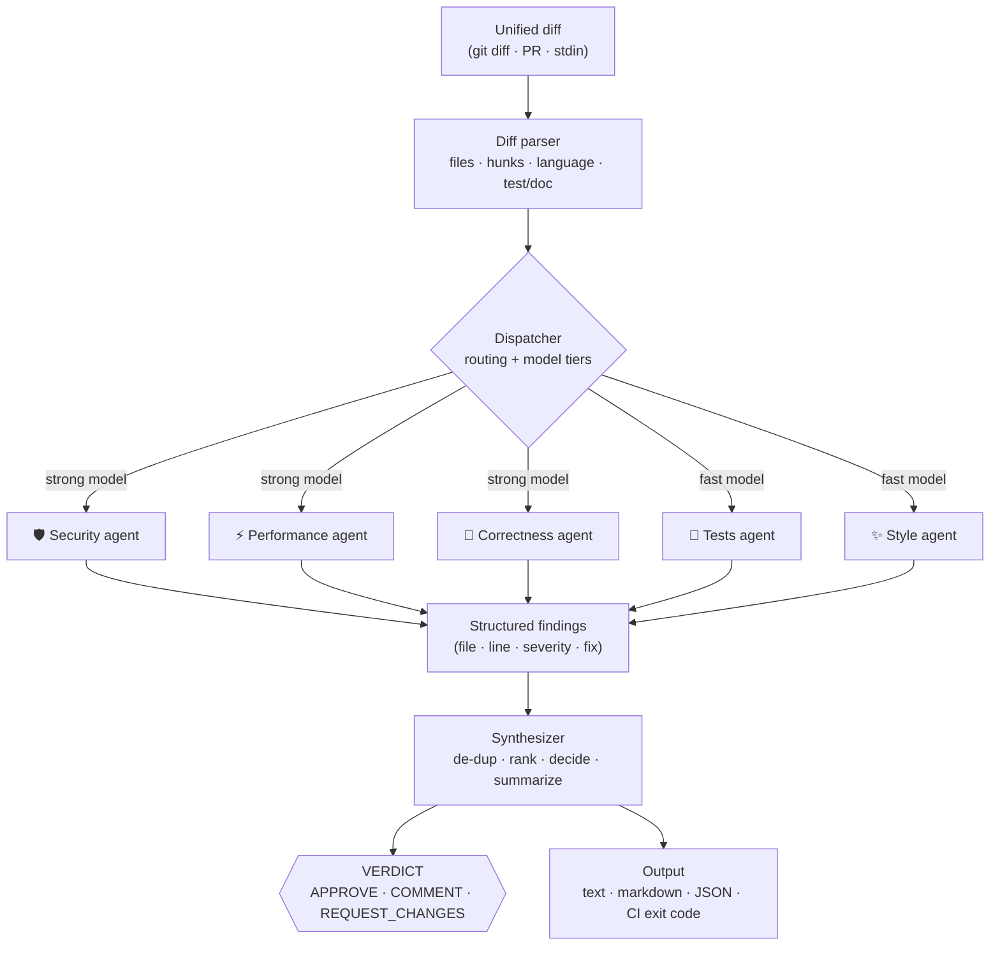

# Quorum

**A multi-agent code reviewer.** Point it at a diff and a *panel* of specialist LLM agents — security, performance, correctness, tests, and style — review it in parallel. A synthesizer then de-duplicates, ranks, and consolidates everything into a single verdict: **APPROVE**, **COMMENT**, or **REQUEST_CHANGES**.

[](https://github.com/skmdroid/quorum/actions/workflows/ci.yml)


**▶ [Try the live demo](https://skmdroid.github.io/quorum/)** — runs entirely in your browser via Pyodide. No install, no API key.

> A single LLM asked to "review this code" spreads itself thin and misses things. Quorum gives each concern its **own** agent with a focused prompt, runs them **concurrently**, routes a **stronger model** to the high-stakes checks (security, correctness) and a **faster one** to nits (style) — then has a synthesizer make the final call. It's built like production software: zero runtime dependencies, **native structured outputs**, a deterministic offline mode, graceful degradation when an agent fails, a **measured detection benchmark**, **per-repo configuration**, and a CI-friendly exit code.

---

## How it works



1. **Parse** — the diff is split into files and hunks; each file is classified by language and whether it's a test or a doc.
2. **Route** — the dispatcher decides *which* specialists to run for this changeset (a docs-only change skips the security/perf agents; if tests were already updated, the "missing tests" check is dropped) and assigns each agent a **model tier**.
3. **Review in parallel** — every specialist runs concurrently against the added lines and returns **structured JSON findings**. If one agent errors out, it's recorded and the panel continues — a single failure never aborts the review.
4. **Synthesize** — findings are de-duplicated, sorted by severity, reduced to a verdict, and summarized for the PR author.
5. **Report** — render as colored terminal text, GitHub-flavored markdown (for a PR comment), or JSON. The process exit code is CI-friendly.

---

## Quickstart (10 seconds, no API key)

Quorum ships with a deterministic **mock reviewer** so you can see it run immediately:

```bash
git clone https://github.com/skmdroid/quorum.git
cd quorum
pip install -e .

# review your current working changes
quorum review

# or a saved diff file
quorum review --diff tests/fixtures/sample.diff
```

```text
VERDICT: REQUEST_CHANGES
Panel review complete: 6 finding(s) consolidated across the specialist agents.

⛔ 1 critical 🔴 1 high 🟡 3 medium ⚪ 1 info

⛔ [CRITICAL] Use of eval()
    app/handler.py:4  ·  security
    eval() on dynamic input allows arbitrary code execution.
    ↳ Parse explicitly or use ast.literal_eval().
...
```

The mock provider needs no model — it's also what the test suite runs against, so CI is fast and free.

---

## Real reviews

Pick a provider with `--provider`. Quorum is model-agnostic; you bring your own key (or use a local model):

| Provider | Setup | Cost |
|---|---|---|
| `mock` | nothing — built in | free, offline |
| `claude-cli` | the [Claude CLI](https://docs.anthropic.com/en/docs/claude-code) on your `PATH` | uses your Claude subscription |
| `anthropic` | `pip install 'quorum-review[anthropic]'` · `export ANTHROPIC_API_KEY=…` | per-token |
| `openai` | `pip install 'quorum-review[openai]'` · `export OPENAI_API_KEY=…` | per-token |
| `ollama` | a running [Ollama](https://ollama.com) server | free, local |

```bash
# real review through the Claude CLI (no API key — uses your subscription)
quorum review --diff pr.diff --provider claude-cli

# Anthropic API, JSON output
export ANTHROPIC_API_KEY=sk-ant-...
quorum review --staged --provider anthropic --format json

# fully local with Ollama, pinning one model for every agent
quorum review --provider ollama:llama3
```

See [`examples/sample_review.md`](examples/sample_review.md) for a full real review (13 findings) produced by the panel.

### Structured output

Agents request **native structured output**, so the reply is schema-valid by construction instead of being scraped out of prose:

- **OpenAI** — `response_format` with a strict `json_schema`
- **Anthropic** — a forced tool call whose `input_schema` *is* the findings schema
- **Ollama** — the `format` field set to the JSON schema (constrained decoding)

Providers that can't enforce a schema — the `claude-cli` subprocess, or a small local model that drifts — fall back to the prompt's JSON instruction plus a tolerant parser that extracts the findings array even when it's wrapped in prose. **Structured-first, with a safety net** — never blindly trusting that free text happens to be valid JSON.

### Model routing

High-stakes checks deserve a stronger model; nits don't. Each agent declares a **tier** (`strong` or `fast`) and the dispatcher resolves it per provider:

| Agent | Tier | Anthropic default | OpenAI default |
|---|---|---|---|
| security, performance, correctness | `strong` | `claude-sonnet-4-5` | `gpt-4o` |
| tests, style | `fast` | `claude-3-5-haiku-latest` | `gpt-4o-mini` |

Pin a single model for everything with `--provider anthropic:claude-opus-4-...` (or any `name:model`).

---

## Evaluation

A reviewer you can't measure is a reviewer you can't trust. Quorum ships a **detection benchmark** — a labeled corpus of diffs with known planted defects ([`evals/dataset/`](evals/dataset)) — and scores the two things you can label with confidence:

- **Recall** — of the planted defects, how many did the panel catch? (scored on the defect diffs)
- **False alarms** — how many findings did it raise on the *clean* diffs, where the answer is "nothing"? (scored on the clean diffs)

```bash
quorum eval                          # deterministic mock — what CI gates on
quorum eval --provider claude-cli    # score the real panel on the same corpus
quorum eval --format markdown        # also: json
```

The **mock** provider is a pure substring heuristic, so its score never moves — CI gates on it with `--min-recall` / `--max-clean-fp`, no API key:

| Category | Detected | Recall | False alarms (clean) |
|---|--:|--:|--:|
| security | 3/4 | 0.75 | 0 |
| performance | 1/1 | 1.00 | 0 |
| correctness | 1/3 | 0.33 | 0 |
| style | 1/1 | 1.00 | 0 |
| **overall** | **6/9** | **0.67** | **0** |

Recall caps at **0.67** because three defects — a SQL injection built by string concatenation, an off-by-one slice, and a missing null guard — have no keyword tell. That gap is the whole point: it's exactly where a deterministic checker ends and a real model earns its keep. Measured on the same corpus, the **`claude-cli` panel catches all nine (recall 1.00) with zero false alarms on the clean diffs.**

**Why no precision/F1?** On a diff that already contains a known defect, a good reviewer also flags *other* real issues the corpus doesn't label — counting those as false positives would punish thoroughness and conflate "wrong" with "unlabeled-but-valid." So extra findings on defect diffs are reported separately, as information, not as errors. (The `claude-cli` run surfaces ~21 such extra findings across the nine defect diffs — on inspection, mostly legitimate.) Measuring recall on planted defects and false alarms on clean code keeps every number honest.

Methodology follows standard metric-driven LLM-eval practice (a golden dataset scored on detection), kept dependency-free so it ships with the package. Add a case by dropping a `.diff` into [`evals/dataset/`](evals/dataset) and its expected findings into `labels.json`.

---

## Usage

```text
quorum review [options]

  --diff FILE        unified diff file, or '-' for stdin
  --staged           review staged changes (git diff --cached)
  --base REF         review commits since REF (git diff REF...HEAD)
  --provider NAME    mock | claude-cli | anthropic | openai | ollama[:model]
  --config FILE      use a specific config (default: discover .quorum.json upward)
  --no-config        ignore any .quorum.json
  --format FMT       text (default) | markdown | json
  --fail-on SEV      exit non-zero if any finding ≥ SEV
                     critical|high|medium|low|never   (default: high)
  --no-color
```

A CLI flag overrides `.quorum.json`, which overrides the built-in defaults.

**Exit codes** make it drop-in for CI: `0` when clean (or all findings are below `--fail-on`), `1` when the gate trips, `2` on a usage/provider error.

```bash
# block a merge on any high/critical finding
quorum review --base origin/main --provider anthropic --fail-on high

# review a diff piped from anywhere
git diff HEAD~3 | quorum review --diff - --format markdown
```

---

## Configuration

Drop a `.quorum.json` at your repo root — Quorum discovers it by searching upward from the working directory, like git finds `.git`. Everything is optional:

```json
{
  "provider": "claude-cli",
  "fail_on": "high",
  "agents": { "tests": { "enabled": false } },
  "rules": [
    "Every network call must pass an explicit timeout.",
    "No print() — use the logging module."
  ],
  "custom_agents": {
    "accessibility": {
      "tier": "fast",
      "focus": "a11y issues in UI code: missing alt text, unlabeled controls, non-semantic markup"
    }
  }
}
```

- **`provider` / `fail_on` / `format`** — per-repo defaults (a CLI flag still wins).
- **`agents.<name>.enabled: false`** — drop a built-in specialist from the panel.
- **`rules`** — house rules injected into every agent's prompt; each agent flags violations that fall within its specialty.
- **`custom_agents`** — register an entirely new specialist (just a `focus` and a model `tier`) with **zero code**. It joins the panel, runs in parallel, and its findings flow through synthesis like any other agent.

`--config PATH` points at a specific file; `--no-config` ignores any. On Python 3.11+ a `.quorum.toml` works too.

---

## Continuous integration

Two workflows ship in [`.github/workflows`](.github/workflows):

- **`ci.yml`** — runs the test suite on Python 3.10–3.13 (mock provider, no secrets).
- **`quorum-review.yml`** — an example PR gate that runs Quorum on the diff and posts the result to the job summary. Swap the mock provider for a real one by adding an API key as a repository secret.

```yaml
# .github/workflows/quorum-review.yml (excerpt)
- run: pip install -e .
- run: |
    git diff origin/${{ github.base_ref }}...HEAD > pr.diff
    quorum review --diff pr.diff --format markdown --fail-on never >> "$GITHUB_STEP_SUMMARY"
```

---

## Design decisions

- **Zero runtime dependencies.** The core is pure standard library; provider SDKs are optional extras imported lazily. The package installs and runs anywhere instantly.
- **Deterministic offline mode.** The mock provider is a real heuristic reviewer, which means the whole pipeline is testable without a network, a key, or flakiness — the test suite runs in milliseconds.
- **Graceful degradation.** Agents run in a thread pool; an exception in one is captured as a failed `AgentResult` and surfaced, but the rest of the panel still produces a verdict. Reviews don't fail closed on a transient model hiccup.
- **Native structured output, tolerant fallback.** Where the provider supports it (OpenAI `json_schema`, Anthropic tool-use, Ollama `format`) the reply is schema-constrained, not parsed out of prose. For providers that can't enforce a schema, a tolerant parser extracts and validates the findings — so the panel never breaks on a model that wraps its JSON in chatter.
- **Configurable, not forkable.** A `.quorum.json` enables/disables agents, injects house rules, and registers brand-new specialist agents — without touching source.
- **Measured, honestly.** A detection benchmark scores recall on planted defects and false alarms on clean code — and deliberately *doesn't* report a precision/F1 that would penalize a thorough reviewer for valid-but-unlabeled findings.
- **Separation of concerns.** Routing, model selection, agent prompts, synthesis, and rendering are independent modules — adding an agent or a provider is a localized change.

---

## Project layout

```
quorum/
├── schema.py        # Finding / AgentResult / ReviewResult dataclasses
├── providers.py     # provider-agnostic LLM layer (mock, claude-cli, anthropic, openai, ollama)
├── diff.py          # unified-diff parser + language/test/doc classification
├── agents.py        # specialist agents: focus, prompts, structured-output parsing
├── dispatcher.py    # routing + model tiers + parallel execution
├── synthesizer.py   # de-dup, ranking, verdict, summary
├── render.py        # text / markdown / json renderers
├── evals.py         # detection benchmark: recall + clean-FP over a labeled corpus
├── config.py        # optional .quorum.json: custom agents, house rules, toggles
└── cli.py           # `quorum review` + `quorum eval` entry points
evals/dataset/       # labeled diff corpus (planted defects + labels.json)
tests/               # deterministic suite (mock provider, no keys)
```

## Testing

```bash
python -m unittest discover -s tests -t .   # unit + eval-harness tests
quorum eval                                  # the detection benchmark itself
```

No API keys, no network — both run entirely against the deterministic mock provider.

## Roadmap

- Inline GitHub PR comments (line-anchored) via the Action
- A "fix-it" agent that proposes patches for accepted findings
- Grow the eval corpus toward a real regression suite
- PyPI release

## License

MIT © Sumanth Kumar M — see [LICENSE](LICENSE).

> Built as an exploration of practical multi-agent orchestration: routing, model-tiering, structured outputs, and the reliability glue that makes a panel of agents usable in CI. Contributions welcome.
